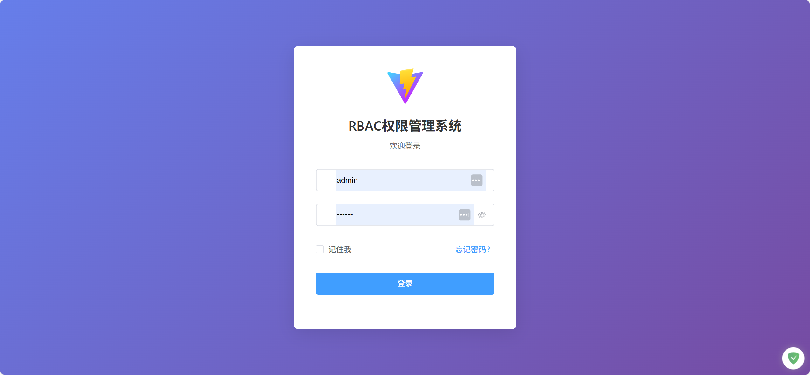
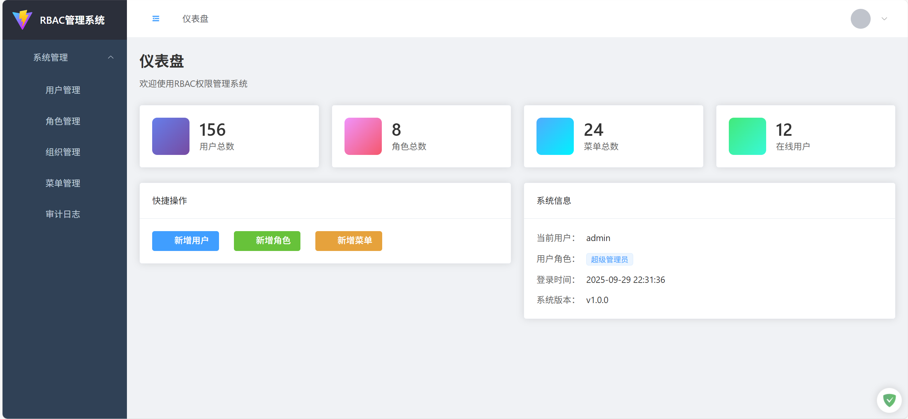
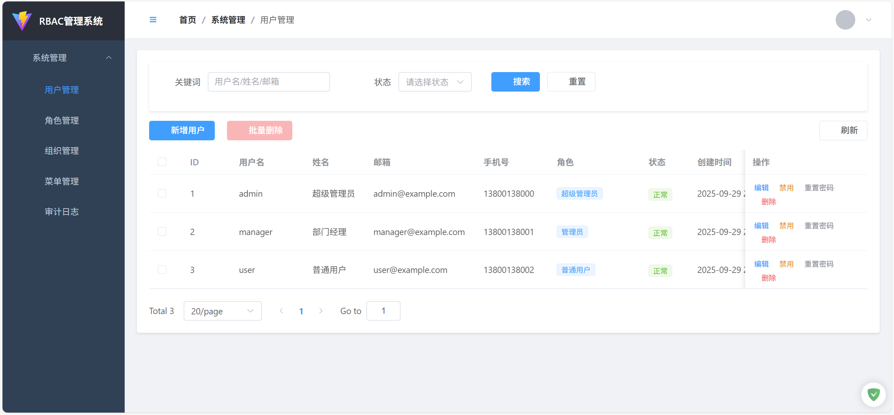
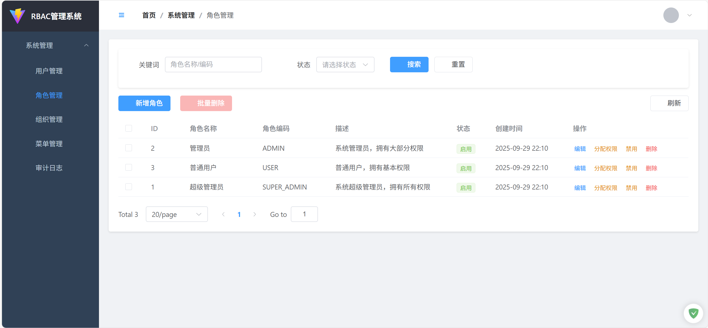
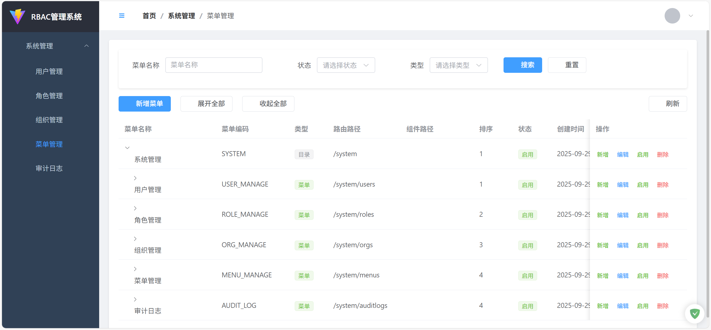
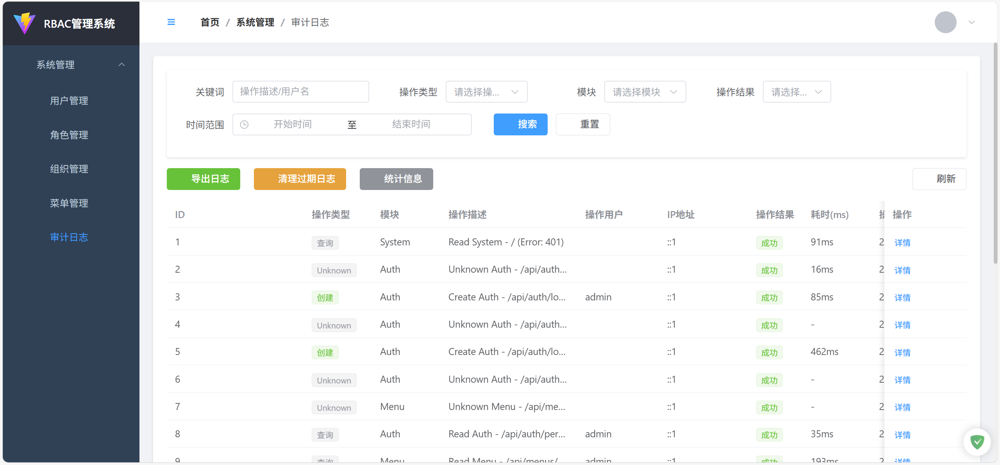

# 企业级RBAC权限管理系统

<div align="center">


**基于 Clean Architecture 的现代化企业级权限管理解决方案**

[在线演示](http://localhost:3000) · [API文档](http://localhost:5000/swagger) · [问题反馈](https://github.com/jinjupeng/Item.ApiServer/issues)

</div>

## ✨ 项目特色

- 🏗️ **Clean Architecture**: 遵循领域驱动设计，层次清晰，依赖倒置
- 🔐 **完整RBAC**: 用户-角色-权限-菜单四级权限控制体系
- 📊 **审计日志**: 完整的操作审计，支持统计分析和数据导出
- 🎨 **现代化前端**: Vue3 + TypeScript + Element Plus 响应式管理界面
- 🚀 **高性能**: .NET 8.0 + EF Core 8.0，支持异步操作和缓存
- 🔧 **开箱即用**: Docker容器化部署，自动数据库初始化
- 📖 **完善文档**: Swagger API文档，代码注释完整

## 🏛️ 系统架构

### 后端架构 (Clean Architecture)

```
┌─────────────────────────────────────────────────────────┐
│                    Presentation Layer                   │
│  ┌─────────────────┐  ┌─────────────────────────────────┐ │
│  │   Controllers   │  │        Middlewares              │ │
│  │   • Auth        │  │   • GlobalException            │ │
│  │   • Users       │  │   • Authentication             │ │
│  │   • Roles       │  │   • Audit Logging              │ │
│  │   • Menus       │  │                                 │ │
│  │   • AuditLogs   │  │                                 │ │
│  └─────────────────┘  └─────────────────────────────────┘ │
└─────────────────────────────────────────────────────────┘
                              │
┌─────────────────────────────────────────────────────────┐
│                   Application Layer                     │
│  ┌─────────────────┐  ┌─────────────────────────────────┐ │
│  │    Services     │  │            DTOs                 │ │
│  │  • UserService  │  │   • UserDto, CreateUserDto      │ │
│  │  • RoleService  │  │   • RoleDto, UpdateRoleDto      │ │
│  │  • MenuService  │  │   • MenuDto, AuditLogDto        │ │
│  │  • AuditService │  │   • QueryDto, PagedResult       │ │
│  └─────────────────┘  └─────────────────────────────────┘ │
└─────────────────────────────────────────────────────────┘
                              │
┌─────────────────────────────────────────────────────────┐
│                    Domain Layer                         │
│  ┌─────────────────┐  ┌─────────────────────────────────┐ │
│  │    Entities     │  │         Value Objects           │ │
│  │   • User        │  │   • UserStatus                  │ │
│  │   • Role        │  │   • MenuType                    │ │
│  │   • Menu        │  │   • PermissionType              │ │
│  │   • Permission  │  │                                 │ │
│  │   • AuditLog    │  │                                 │ │
│  └─────────────────┘  └─────────────────────────────────┘ │
└─────────────────────────────────────────────────────────┘
                              │
┌─────────────────────────────────────────────────────────┐
│                Infrastructure Layer                     │
│  ┌─────────────────┐  ┌─────────────────────────────────┐ │
│  │  Repositories   │  │        External Services        │ │
│  │ • UserRepository│  │   • DatabaseSeeder              │ │
│  │ • RoleRepository│  │   • JwtTokenService             │ │
│  │ • MenuRepository│  │   • EmailService                │ │
│  │ • AuditRepository│  │   • FileService                │ │
│  └─────────────────┘  └─────────────────────────────────┘ │
└─────────────────────────────────────────────────────────┘
```

### 前端架构 (Vue3 + TypeScript)

```
frontend/
├── src/
│   ├── api/                    # API服务层
│   │   ├── auth.ts            # 认证相关API
│   │   ├── users.ts           # 用户管理API
│   │   ├── roles.ts           # 角色管理API
│   │   ├── menus.ts           # 菜单管理API
│   │   └── auditLogs.ts       # 审计日志API
│   ├── components/            # 通用组件
│   ├── layout/               # 布局组件
│   ├── router/               # 路由配置
│   ├── stores/               # Pinia状态管理
│   │   ├── auth.ts           # 认证状态
│   │   └── app.ts            # 应用状态
│   ├── types/                # TypeScript类型定义
│   ├── utils/                # 工具函数
│   ├── views/                # 页面组件
│   │   ├── auth/             # 认证页面
│   │   ├── dashboard/        # 仪表盘
│   │   └── system/           # 系统管理
│   │       ├── users/        # 用户管理
│   │       ├── roles/        # 角色管理
│   │       ├── menus/        # 菜单管理
│   │       └── auditlog/     # 审计日志
│   └── styles/               # 样式文件
```

## 🚀 核心功能

### 🔐 认证授权
- **JWT Token认证**: 无状态认证，支持Token自动刷新
- **多端登录控制**: 支持单点登录和多端并发登录
- **密码安全**: BCrypt加密，支持密码强度验证
- **验证码保护**: 登录验证码，防止暴力破解

### 👥 用户管理
- **用户CRUD**: 完整的用户生命周期管理
- **状态管理**: 正常/禁用/锁定状态控制
- **批量操作**: 支持批量导入、导出、删除
- **密码重置**: 管理员重置和用户自助重置

### 🛡️ 角色权限
- **角色管理**: 灵活的角色定义和权限分配
- **权限矩阵**: 菜单权限、按钮权限、API权限
- **权限继承**: 支持角色权限继承和覆盖
- **动态权限**: 运行时权限验证和菜单过滤

### 📋 菜单管理
- **树形结构**: 无限级菜单树，支持拖拽排序
- **菜单类型**: 目录、菜单、按钮三种类型
- **图标配置**: 丰富的图标库和自定义图标
- **路由配置**: 前端路由自动生成

### 📊 审计日志
- **操作记录**: 完整记录用户操作轨迹
- **数据变更**: 详细记录数据变更前后对比
- **统计分析**: 多维度统计图表和报表
- **日志导出**: 支持CSV格式导出和数据清理

## 🛠️ 技术栈

### 后端技术
- **框架**: .NET 8.0 + ASP.NET Core Web API
- **ORM**: Entity Framework Core 8.0
- **数据库**: MySQL 8.0+ / SQL Server 2019+
- **认证**: JWT Bearer + ASP.NET Core Identity
- **文档**: Swagger/OpenAPI 3.0
- **日志**: Serilog 结构化日志
- **缓存**: MemoryCache + Redis (可选)
- **验证**: FluentValidation
- **映射**: Mapster 高性能对象映射

### 前端技术
- **框架**: Vue 3.4 + Composition API
- **语言**: TypeScript 5.3
- **构建**: Vite 7.0 + Vue CLI
- **UI库**: Element Plus 2.4
- **状态管理**: Pinia 2.1
- **路由**: Vue Router 4.2
- **HTTP**: Axios 1.6
- **工具**: ESLint + Prettier + Sass

### 开发运维
- **容器化**: Docker + Docker Compose
- **版本控制**: Git + GitHub
- **CI/CD**: GitHub Actions (可选)
- **监控**: Application Insights (可选)

## 📦 快速开始

### 环境要求

- **.NET 8.0 SDK** 或更高版本
- **Node.js 18+** 和 **npm/yarn**
- **MySQL 8.0+** 或 **SQL Server 2019+**
- **Docker** (可选，用于容器化部署)

### 1. 克隆项目

```bash
git clone https://github.com/jinjupeng/Item.ApiServer.git
cd ./Item.ApiServer
```

### 2. 后端配置

```bash
# 进入后端目录
cd src

# 配置数据库连接字符串
# 编辑 ApiServer.WebApi/appsettings.json
{
  "ConnectionStrings": {
    "DefaultConnection": "Server=localhost;Database=ApiServerDb;Uid=root;Pwd=your_password;"
  }
}

# 安装依赖并运行
dotnet restore
dotnet run --project ApiServer.WebApi
```

### 3. 前端配置

```bash
# 进入前端目录
cd frontend

# 安装依赖
npm install

# 配置API地址 (编辑 .env 文件)
VITE_API_BASE_URL=http://localhost:5000/api

# 启动开发服务器
npm run dev
```

### 4. Docker 部署 (推荐)

```bash
# 使用 Docker Compose 一键部署
docker-compose up -d

# 访问应用
# 前端: http://localhost:3000
# 后端API: http://localhost:5000
# Swagger文档: http://localhost:5000/swagger
```

### 5. 默认账户

系统启动后会自动初始化默认数据：

| 角色 | 用户名 | 密码 | 权限 |
|------|--------|------|------|
| 超级管理员 | admin | 123456 | 所有权限 |
| 管理员 | manager | 123456 | 管理权限 |
| 普通用户 | user | 123456 | 基础权限 |

## 📸 系统截图

### 登录页面


### 仪表盘


### 用户管理


### 角色权限


### 菜单管理


### 审计日志


## 📚 API 文档

启动后端服务后，访问 [http://localhost:5000/swagger](http://localhost:5000/swagger) 查看完整的API文档。

### 主要API端点

```
认证相关
POST   /api/auth/login          # 用户登录
POST   /api/auth/refresh        # 刷新Token
POST   /api/auth/logout         # 用户登出

用户管理
GET    /api/users               # 获取用户列表
POST   /api/users               # 创建用户
PUT    /api/users/{id}          # 更新用户
DELETE /api/users/{id}          # 删除用户

角色管理
GET    /api/roles               # 获取角色列表
POST   /api/roles               # 创建角色
PUT    /api/roles/{id}          # 更新角色
DELETE /api/roles/{id}          # 删除角色

菜单管理
GET    /api/menus               # 获取菜单树
POST   /api/menus               # 创建菜单
PUT    /api/menus/{id}          # 更新菜单
DELETE /api/menus/{id}          # 删除菜单

审计日志
GET    /api/auditlogs           # 获取审计日志
GET    /api/auditlogs/statistics # 获取统计信息
GET    /api/auditlogs/export    # 导出日志
```

## 🔧 配置说明

### 后端配置 (appsettings.json)

```json
{
  "ConnectionStrings": {
    "DefaultConnection": "数据库连接字符串"
  },
  "JwtSettings": {
    "SecretKey": "JWT密钥",
    "Issuer": "签发者",
    "Audience": "接收者",
    "ExpiryMinutes": 60,
    "RefreshTokenExpiryDays": 7
  },
  "Logging": {
    "LogLevel": {
      "Default": "Information"
    }
  }
}
```

### 前端配置 (.env)

```env
# API基础地址
VITE_API_BASE_URL=http://localhost:5000/api

# 应用标题
VITE_APP_TITLE=RBAC权限管理系统

# 是否启用Mock数据
VITE_USE_MOCK=false
```

## 🤝 贡献指南

我们欢迎所有形式的贡献！请遵循以下步骤：

1. Fork 本仓库
2. 创建特性分支 (`git checkout -b feature/AmazingFeature`)
3. 提交更改 (`git commit -m 'Add some AmazingFeature'`)
4. 推送到分支 (`git push origin feature/AmazingFeature`)
5. 开启 Pull Request

### 开发规范

- 后端遵循 Clean Architecture 原则
- 前端使用 Vue 3 Composition API
- 代码注释完整，遵循各语言最佳实践
- 提交信息使用 [Conventional Commits](https://conventionalcommits.org/) 规范

## 📋 更新日志

### v2.0.0 (2025-09-27)
- ✨ 重构为 Clean Architecture 架构
- ✨ 新增 Vue3 + TypeScript 前端
- ✨ 完整的审计日志系统
- ✨ Docker 容器化支持
- 🐛 修复若干安全问题

### v1.0.0 (2021-11-15)
- ✨ 基础RBAC权限系统
- ✨ JWT认证授权
- ✨ Swagger API文档
- ✨ 基础用户角色管理

## 🗺️ 开发路线

- [ ] 微服务架构支持
- [ ] 多租户系统
- [ ] 移动端适配
- [ ] 国际化支持
- [ ] 高级报表系统
- [ ] 工作流引擎
- [ ] 消息通知系统

## 📄 许可证

本项目采用 [MIT](LICENSE) 许可证 - 查看 LICENSE 文件了解详情

## 👨‍💻 关于作者

**jinjupeng**
- GitHub: [@jinjupeng](https://github.com/jinjupeng)


## 💖 支持项目

如果这个项目对你有帮助，请给一个 ⭐️ Star 支持一下！

---

<div align="center">
  Made with ❤️ by <a href="https://github.com/jinjupeng">jinjupeng</a>
</div>
